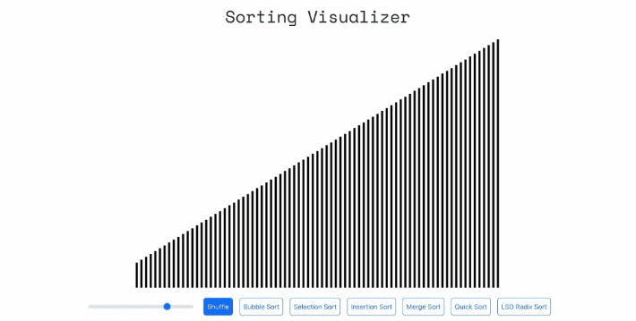

# Sorting Visualizer

This project implements an animated demonstration of several quadratic (sequential), recursive (divide-and-conquer), and counting sorting algorithms.

Note: Some algorithms (particularly selection sort and insertion sort) deliberately perform additional swaps to provide needed delays in the animation.

The application is deployed on GitHub Pages: https://rishiskhare.github.io/sorting-visualizer/
